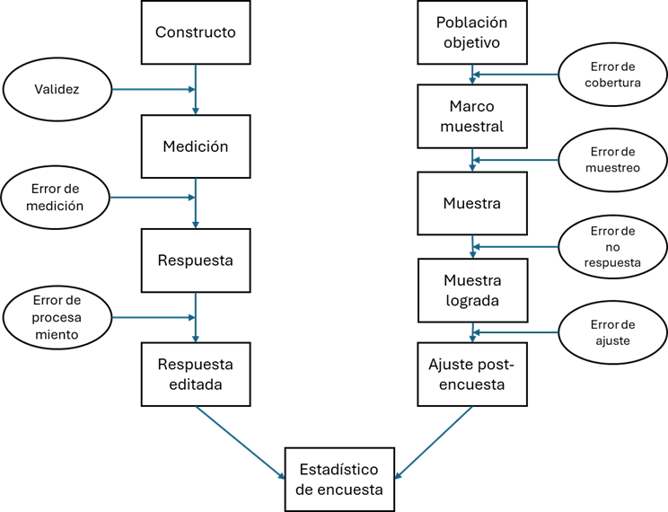
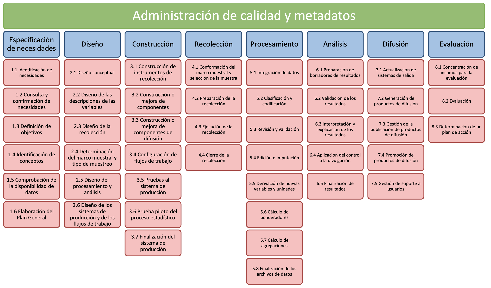

# Toda cifra es una estimación

## Tres cifras que ya conocen {.smaller}

La semana pasada vimos que estas cifras **organizan la vida pública**:

- la tasa de **pobreza** que publica la CASEN,
- la tasa de desocupación de la **ENE**, estimada para trimestres móviles y actualizada mensualmente,
- la **aprobación presidencial** de Cadem cada lunes.

Ninguna de ellas es el valor verdadero. Todas son **estimaciones**: aproximaciones a un parámetro poblacional construidas a partir de unos pocos miles de casos, medidos con instrumentos imperfectos.

**La pregunta de hoy:** ¿qué separa la cifra publicada del valor que queríamos conocer? ¿Y cómo se administra esa distancia?

## Estimación, parámetro y error {.smaller}

::: {style="font-size:0.95em;"}
- **Parámetro poblacional:** el valor que obtendríamos si midiéramos *a toda la población, sin error*. Es la cantidad que nos interesa, y casi nunca la observamos.
- **Estimación (estadístico de encuesta):** el valor que efectivamente calculamos con los datos recogidos.
- **Error de encuesta:** la desviación entre ambos.
:::

$$\text{Error} = \text{Estimación} - \text{Parámetro}$$

En este curso, "error" **no significa equivocación**: significa desviación entre lo que el diseño busca y lo que logra. Una encuesta bien hecha también tiene error; la diferencia es que lo conoce y lo gestiona.

::: {style="border-radius:0.7em;padding:0.8em 1em;background-color:#f2f2f2;font-size:0.85em;"}
Los desvíos provienen de dos familias: errores de **observación** (medimos mal a quienes medimos) y errores de **no observación** (no medimos a una parte de la población: por marco, por muestreo o por no respuesta).
:::

## Dos inferencias encadenadas {.smaller}

Según Groves et al., toda estadística de encuesta descansa en **dos saltos inferenciales**:

1. **De la respuesta al constructo** (medición): inferimos que lo que la persona contestó refleja el concepto que queríamos medir.
2. **De los respondientes a la población** (representación): inferimos que quienes contestaron describen al conjunto que nos interesa.

Si cualquiera de los dos saltos falla, la cifra final queda comprometida — aunque el otro sea impecable.

**La ruta de hoy:**

- **Bloque 1 — el mapa de los errores:** el Error Total de Encuesta (TSE), fuente por fuente.
- **Bloque 2 — el mapa del trabajo:** el GSBPM, el estándar internacional que ordena el proceso de producción.

# La perspectiva del diseño

## El ciclo de vida de una encuesta {.smaller}

Groves et al. proponen mirar la encuesta primero **desde el diseño**: dos columnas de pasos que convergen en la cifra final.

::: columns
::: {.column style="width:48%;text-align:center;font-size:0.62em;"}
**MEDICIÓN** *(¿qué medimos?)*

**Constructo**

⬇️

**Medición** (instrumento)

⬇️

**Respuesta**

⬇️

**Dato editado**

:::

::: {.column style="width:48%;text-align:center;font-size:0.62em;"}
**REPRESENTACIÓN** *(¿a quién medimos?)*

**Población objetivo**

⬇️

**Marco muestral**

⬇️

**Muestra**

⬇️

**Respondientes**

⬇️

**Ajustes post-encuesta**

:::
:::

::: {style="text-align:center;font-size:0.7em;margin-top:0.3em;"}
⬇️ Ambas columnas convergen en el **estadístico de encuesta** (la cifra publicada)
:::

## La columna de la medición {.smaller}

::: {style="font-size:0.9em;"}
- **Constructo:** el concepto abstracto que nos interesa — pobreza, victimización, apoyo político, uso del tiempo. Como vimos la semana pasada, rara vez es observable de manera directa.
- **Medición:** la traducción del constructo a un instrumento concreto — preguntas, escalas, registros. Aquí se decide *cómo* preguntar.
- **Respuesta:** lo que la persona efectivamente contesta, mediado por comprensión, memoria, motivación y deseabilidad social.
- **Dato editado:** la respuesta tras codificación, edición e imputación — lo que finalmente entra al análisis.
:::

 

Cada flecha es una **traducción**, y toda traducción puede perder o distorsionar contenido. La pregunta sobre victimización de la ENUSC no *es* la inseguridad; es su representante operativo.

## La columna de la representación {.smaller}

::: {style="font-size:0.85em;"}
- **Población objetivo:** el conjunto que queremos describir. CASEN: hogares en viviendas particulares del territorio nacional (excluye zonas de difícil acceso definidas).
- **Marco muestral:** el dispositivo que nos da acceso a esa población — una lista, un conjunto de áreas, un panel. CASEN usa el marco de viviendas del INE; Cadem, su panel online.
- **Muestra:** el subconjunto seleccionado desde el marco según un mecanismo de selección.
- **Respondientes:** quienes efectivamente contestan. Nunca son todos los seleccionados.
- **Ajustes post-encuesta:** ponderadores y correcciones que intentan que los respondientes "devuelvan" la forma de la población.
:::

 

En cada eslabón **se pierde gente**, y la pregunta clave nunca es solo *cuántos* se pierden, sino *cuán distintos* son de los que quedan.

## El diseño se vuelve proceso {.smaller}

Si ordenamos esas decisiones en el tiempo, el diseño se convierte en una **secuencia de tareas**:

::: {style="font-size:0.9em;"}
1. Definir los **objetivos** de investigación.
2. Elegir el **modo** de recolección y el **marco muestral**.
3. Construir y **pretestear el cuestionario**; diseñar y **seleccionar la muestra**.
4. **Reclutar y medir** a la muestra (trabajo de campo).
5. **Codificar y editar** los datos.
6. Construir **ponderadores** y ajustes.
7. **Analizar** y publicar.
:::

 

En el bloque 2 esta secuencia reaparece formalizada y ampliada como estándar internacional: el GSBPM.

# La perspectiva de la calidad: las siete fuentes de error

## El mismo mapa, ahora con errores {.smaller}

La segunda mirada de Groves et al. recorre el mismo diagrama preguntando: **¿qué desvío puede introducirse en cada flecha?**

{fig-align="center" style="max-height:60vh;"}

::: {style="text-align:center;font-size:0.75em;margin-top:0.3em;"}
El **Error Total de Encuesta (TSE)** es el marco que integra estas siete fuentes de error.
:::

## Un mínimo de notación {.smaller}

Para definir cada error con precisión, Groves et al. usan cuatro símbolos por persona $i$:

::: {style="font-size:0.9em;"}
| Símbolo | Qué representa |
|:---:|:---|
| $\mu_i$ | el valor del **constructo** en la persona $i$ (inobservable) |
| $Y_i$ | el valor que produciría la **medida ideal** del constructo |
| $y_i$ | la **respuesta** que la persona efectivamente da |
| $y_{ip}$ | el valor que queda **tras el procesamiento** (codificación, edición) |

: {tbl-colwidths="[15,85]"}
:::

Y en la rama de la representación: el parámetro es la media poblacional $\bar{Y}$; la estimación, la media (ponderada) de los respondientes.

 

Cada fuente de error se define como **la brecha entre dos eslabones consecutivos**. Veámoslas una por una.

## Validez {.smaller}

**¿La medida captura el constructo?** Es la brecha entre $\mu_i$ e $Y_i$: el desvío que existiría *incluso con una aplicación perfecta* del instrumento.

 

- Medir "inseguridad" preguntando por la *probabilidad percibida de ser víctima* captura un juicio cognitivo; medirla preguntando por el *miedo a caminar de noche* captura una emoción. Son constructos vecinos pero distintos.
- Medir "pobreza" solo con ingresos deja fuera dimensiones que la definición conceptual puede incluir (de ahí la pobreza multidimensional de CASEN).

 

Es el territorio clásico de la **psicometría** (la veremos en la Unidad 3). Por ahora, lo esencial: la validez se juega **antes** de salir a terreno, en el diseño del instrumento.

## Error de medición {.smaller}

**La respuesta difiere del valor verdadero:** $y_i \neq Y_i$. Surge en el acto mismo de responder.

::: {style="font-size:0.9em;"}
- **Sesgo de respuesta** (desvío sistemático): subreporte de consumo de drogas o de ingresos; sobre-reporte de asistencia a votar. La **deseabilidad social** empuja siempre en la misma dirección.
- **Varianza de respuesta** (desvío inestable): la misma persona, ante la misma pregunta, contesta distinto en ocasiones distintas — comprensión ambigua, ánimo, contexto.
:::

Sus motores principales: la **redacción de la pregunta**, el **modo** de aplicación (¿hay un entrevistador presente?), el **entrevistador** mismo y el **respondiente** (memoria, motivación).

::: {style="border-radius:0.7em;padding:0.8em 1em;background-color:#f2f2f2;font-size:0.85em;"}
Ejemplo clásico: en encuestas cara a cara el consumo de drogas se subreporta sistemáticamente respecto de modos autoadministrados. El instrumento es el mismo; el modo cambia la respuesta.
:::

## Error de procesamiento {.smaller}

**Entre la respuesta y el dato analizable hay trabajo humano y computacional**, y ese trabajo también introduce desvíos: $y_{ip} \neq y_i$.

 

- **Codificación** de preguntas abiertas: llevar "trabajo en una ferretería atendiendo público" a un código de ocupación (CIUO-08) exige juicio; codificadores distintos pueden decidir distinto.
- **Edición**: reglas que corrigen inconsistencias (un "jefe de hogar de 9 años") pueden corregir de más o de menos.
- **Digitación y captura**, cada vez menos relevantes con instrumentos electrónicos, pero no extintas.

 

Es el error más invisible: ocurre en la oficina, después del campo, y casi nunca se reporta en las fichas técnicas.

## Error de cobertura {.smaller}

**Existe antes de seleccionar a nadie:** es una propiedad del marco. Personas de la población objetivo que **no están en el marco** tienen probabilidad cero de ser encuestadas.

$$\text{Sesgo de cobertura} = \frac{U}{N}\,(\bar{Y}_C - \bar{Y}_U)$$

donde $U/N$ es la proporción **no cubierta** y $(\bar{Y}_C - \bar{Y}_U)$ la diferencia entre cubiertos y no cubiertos.

::: {style="border-radius:0.7em;padding:0.8em 1em;background-color:#f2f2f2;font-size:0.85em;"}
**Ejemplo de Groves et al.:** si el 5% de los hogares no tiene teléfono, y los con teléfono promedian 14,3 años de escolaridad contra 11,2 de los sin teléfono, una encuesta telefónica sobreestima la escolaridad en $0{,}05 \times (14{,}3 - 11{,}2) \approx 0{,}16$ años — sin importar el tamaño de la muestra.
:::

La versión chilena actual: un **panel online** no cubre a quienes no usan internet — y esa población no es aleatoria: es mayor, más rural y de menor nivel educativo (la "brecha digital").

## Error de muestreo {.smaller}

**El único error deliberado:** aceptamos observar una parte en lugar del todo. Es el precio del muestreo, y el único error que la estadística clásica domestica por completo.

::: {style="font-size:0.9em;"}
- **Varianza de muestreo:** con otra muestra del mismo diseño, la cifra habría sido algo distinta. Es lo que mide el "margen de error" de las fichas técnicas.
- **Sesgo de muestreo:** aparece si algunos miembros del marco tienen probabilidad cero o desconocida de selección.

Cuatro principios de diseño lo gobiernan (los profundizaremos en la Unidad 2):

1. selección **probabilística** (probabilidades conocidas y no nulas),
2. **estratificación** (dividir el marco en grupos homogéneos: reduce varianza),
3. **conglomerados** (seleccionar grupos: abarata, pero aumenta varianza),
4. **tamaño muestral** (más casos: reduce varianza... de muestreo, no los sesgos).
:::

::: {style="border-radius:0.7em;padding:0.8em 1em;background-color:#f2f2f2;font-size:0.85em;"}
El "margen de error" que reportan las encuestas **solo cuantifica el error de muestreo**. Las otras seis fuentes no aparecen en ese número.
:::

## Error de no respuesta {.smaller}

**De los seleccionados, una parte no contesta.** El daño depende de dos factores a la vez:

$$\text{Sesgo de no respuesta} \approx \frac{m}{n}\,(\bar{y}_r - \bar{y}_m)$$

la **proporción de no respondientes** ($m/n$) multiplicada por la **diferencia entre respondientes y no respondientes** ($\bar{y}_r - \bar{y}_m$).

 

La consecuencia, en palabras de Groves et al.: **las tasas de respuesta, por sí solas, no son indicadores de calidad**. Una tasa alta *reduce el riesgo* de sesgo (acota $m/n$), pero no lo elimina: si los que faltan son muy distintos, poca no respuesta puede sesgar mucho.

 

Y al revés: una tasa baja con no respondientes parecidos a los respondientes puede ser inofensiva — *para esa variable*. El sesgo es **específico de cada estadística**, no de la encuesta como un todo.

## Error de ajuste {.smaller}

**El último eslabón también puede fallar.** Los ajustes post-encuesta (ponderación, imputación, calibración) intentan compensar cobertura y no respuesta usando información auxiliar.

::: {style="font-size:0.9em;"}
- Ejemplo simple: si en un subgrupo respondió el 85% de los seleccionados, cada respondiente recibe peso $w_i = 1/0{,}85$ para "representar" también a los ausentes de su grupo.
- La **calibración** ajusta la muestra a totales poblacionales conocidos (proyecciones de población, por ejemplo).
:::

El supuesto silencioso: que dentro de cada celda de ajuste, los que respondieron **se parecen** a los que no. Si el supuesto falla, el ajuste puede **reducir o aumentar** el error — y típicamente aumenta la varianza (pesos muy desiguales inflan la inestabilidad).

 

Ajustar no elimina el problema: lo traslada desde los datos hacia los **supuestos**.

## Sesgo y varianza {.smaller}

Cada fuente de error puede operar de dos formas, y la distinción es central:

- **Sesgo:** el desvío **sistemático**. Si repitiéramos la encuesta muchas veces con el mismo diseño, empujaría siempre en la misma dirección (ej.: el subreporte de ingresos). Aumentar los casos **no** lo reduce.
- **Varianza:** el desvío **variable**. Cambia de una réplica a otra —otra muestra, otros entrevistadores, otro día de aplicación— sin dirección fija. Aumentar los casos (o las réplicas) **sí** la reduce.

El criterio que integra ambos componentes es el **error cuadrático medio**:

$$\text{ECM} = \text{Sesgo}^2 + \text{Varianza}$$

El diseño óptimo no minimiza una fuente favorita: **minimiza el ECM total al costo disponible**. A veces conviene tolerar más varianza de muestreo (una muestra más chica) para financiar mejor seguimiento de no respondientes.

## Cada fuente, ¿sesgo o varianza? {.smaller}

::: {style="font-size:0.85em;"}
| Fuente | Componente típico | Ejemplo |
|:---|:---|:---|
| Validez | Sesgo | la pregunta captura otro constructo |
| Medición | Sesgo y varianza | deseabilidad social; inestabilidad de respuesta |
| Procesamiento | Sesgo y varianza | reglas de codificación; codificadores que difieren |
| Cobertura | Sesgo | marco que excluye a un grupo distinto |
| Muestreo | Varianza (y sesgo si el diseño falla) | margen de error |
| No respuesta | Sesgo (y varianza) | ausentes sistemáticamente distintos |
| Ajuste | Sesgo y varianza | supuestos de ponderación; pesos extremos |
:::

## ¿Para qué sirve el TSE? {.smaller}

El TSE **no es una checklist para llenar**: casi ninguna encuesta estima sus siete componentes (Groves & Lyberg, 2010). Es una **lente diagnóstica** con dos usos:

::: {style="font-size:0.9em;"}
1. **Al diseñar:** repartir un presupuesto fijo entre fuentes de error. ¿Conviene gastar en más casos, en mejor pretesteo del cuestionario o en recontactar no respondientes? El TSE da el criterio: minimizar el error total, no el error favorito.
2. **Al evaluar:** leer cualquier encuesta — propia o ajena — preguntando sistemáticamente por las siete fuentes.
:::

Sus límites, según sus propios autores:

::: {style="font-size:0.9em;"}
- la mayoría de los componentes **no se estima** en la práctica (medirlos exige rediseños costosos: reentrevistas, interpenetración de entrevistadores);
- la calidad tiene dimensiones **no estadísticas** que el TSE no captura: relevancia, oportunidad, accesibilidad, credibilidad — la "aptitud para el uso" (*fitness for use*).
:::

Aun así, es **el paradigma organizador del campo**: el lenguaje común con que se discute la calidad de cualquier encuesta.

# Del error al proceso: el GSBPM

## Dos preguntas distintas {.smaller}

- El **TSE** responde: ¿dónde puede desviarse el dato? Descompone el **error**.
- El **GSBPM** responde: ¿qué actividades hay que realizar y en qué orden? Descompone el **trabajo**.

Son las dos perspectivas que distingue Groves et al., la de la calidad y la del diseño, convertidas en marcos de trabajo. El **GSBPM** es el estándar internacional con que las oficinas de estadística describen y organizan su producción.

## Qué es el GSBPM {.smaller}

**Generic Statistical Business Process Model** (Modelo Genérico del Proceso Estadístico), desarrollado bajo la UNECE.

::: {style="font-size:0.9em;"}
- **Qué hace:** describe y define el conjunto de actividades necesarias para producir estadísticas oficiales, con terminología armonizada — un **lenguaje común** para documentar, comparar y mejorar procesos.
- **Qué no es:** una receta rígida. Es una **matriz de actividades posibles**: se aplica con flexibilidad, las fases se iteran, se ejecutan en paralelo o se omiten según el caso.
- **Origen:** creado en 2008 por el grupo UNECE/Eurostat/OCDE sobre metadatos (METIS), sobre la base del modelo de Statistics New Zealand. Versiones 4.0 (2009), 5.0 (2013), 5.1 (2019) y **5.2 (mayo 2025)**.
- **Adopción:** estándar de facto en las oficinas nacionales de estadística; el **INE de Chile** lo utiliza en su producción estadística; el nuevo *Handbook* de encuestas de hogares de la ONU (2026) organiza sus capítulos directamente sobre las fases del GSBPM.
- **Novedades de la v5.2:** mayor énfasis en datos administrativos y fuentes no tradicionales, menciones explícitas de *machine learning* e IA, recolección multimodo y pseudoanonimización.
:::

# Las ocho fases

## El esquema del GSBPM {.smaller}

Tres niveles: **fases** (8) → **subprocesos** (44) → tareas.

{fig-align="center" style="width:100%;max-height:75vh;"}

## Fases 1 a 3: de la necesidad al instrumento {.smaller}

::: {style="font-size:0.9em;"}
1. **Especificar necesidades:** identificar qué información se requiere y para quién; consultar y confirmar las necesidades con los usuarios; definir objetivos y conceptos; comprobar si los datos ya existen; y elaborar el plan general.

2. **Diseñar:** definir los productos esperados, las variables y su operacionalización, el modo de recolección, el marco muestral y el tipo de muestreo, y los sistemas de procesamiento y análisis.

3. **Construir:** programar los instrumentos de recolección, montar los componentes y flujos de producción, y probar todo el sistema — incluida la **prueba piloto** — antes de salir a terreno.
:::

## Fases 4 a 6: del terreno a los resultados {.smaller}

::: {style="font-size:0.9em;"}
4. **Recolectar:** conformar el marco y seleccionar la muestra, preparar el operativo (capacitación, materiales, logística), ejecutar el trabajo de campo y cerrarlo formalmente.

5. **Procesar:** integrar los datos, clasificar y codificar, revisar y validar, editar e imputar, derivar nuevas variables y calcular ponderadores y agregaciones.

6. **Analizar:** preparar los borradores de resultados, validarlos, interpretarlos y explicarlos, y aplicar el **control de divulgación** para proteger la confidencialidad antes de publicar.
:::

## Fases 7 y 8: hacia los usuarios y la mejora {.smaller}

::: {style="font-size:0.9em;"}
7. **Diseminar:** generar los productos de difusión (informes, tabulados, microdatos), gestionar su publicación, promoverlos y dar soporte a los usuarios.

8. **Evaluar:** reunir los insumos de la ronda (datos de proceso, retroalimentación de usuarios y del equipo), evaluar qué funcionó y qué no, y acordar un **plan de acción** para la siguiente iteración.
:::

## No es una línea recta {.smaller}

El GSBPM se dibuja como secuencia, pero es **explícitamente no secuencial**:

::: {style="font-size:0.9em;"}
- Las fases **iteran**: un piloto (fase 3) puede devolver al diseño (fase 2); la validación (fase 6) puede reabrir el procesamiento (fase 5).
- En encuestas **periódicas**, las fases se parten en dos circuitos: las de **cambio** (especificar, diseñar, construir, evaluar) se activan cuando algo se rediseña; las **corrientes** (recolectar → procesar → analizar → diseminar) corren en cada ronda. La ENE no rediseña su cuestionario todos los meses.
- Y hay **actividades transversales** que cruzan todas las fases: gestión de **calidad**, de **metadatos**, de **datos** (seguridad, archivo), de **datos de proceso** (paradata), del **conocimiento** (documentación) y de **proveedores de datos**.
:::

::: {style="border-radius:0.7em;padding:0.8em 1em;background-color:#f2f2f2;font-size:0.85em;"}
La gestión de **calidad** no es una fase, sino una actividad transversal a todo el proceso: es ahí donde el TSE se conecta con el GSBPM.
:::

# La relación entre TSE y GSBPM

## Dónde se juega cada error {.smaller}

Cada fuente del TSE tiene una dirección en el GSBPM — el lugar donde se previene, se produce o se corrige:

::: {style="font-size:0.72em;"}
| Fuente de error (TSE) | Dónde se juega (GSBPM) |
|:---|:---|
| **Validez / especificación** | Fases 1–2: definición de necesidades, conceptos y variables |
| **Cobertura** | Fase 2 (diseñar marco) y subproceso 4.1 (crear marco y seleccionar muestra) |
| **Muestreo** | Fase 2 (diseño muestral) y 4.1 (selección); varianza estimada en 5.7 |
| **Medición** | Fases 2–3 (diseño y construcción del instrumento, pretesteo) y 4 (campo) |
| **No respuesta** | Fase 4 (contacto, seguimiento, gestión del campo) y 5.6 (ponderación) |
| **Procesamiento** | Fase 5: codificación, edición, imputación |
| **Ajuste** | Fases 5–6: ponderadores, calibración, validación de outputs |
:::

## Por qué se necesitan mutuamente {.smaller}

- La **perspectiva de la calidad** (TSE) entrega los **criterios**: qué puede salir mal, qué riesgo importa más, dónde poner el presupuesto.
- La **perspectiva del diseño/proceso** (GSBPM) entrega la **organización**: qué actividades existen, en qué orden, con qué insumos y productos.

Por eso este curso los usa **juntos**. En el proyecto grupal deberán diagnosticar con el TSE, ordenar el diagnóstico con el GSBPM.

## Para su vida profesional {.smaller}

En la práctica, **pocas organizaciones aplican el GSBPM "completo"**: muchas realizan estas actividades de facto, sin nombrarlas, o las desarrollan de forma parcial.

 

Su valor para ustedes es como **marco mental**:

::: {style="font-size:0.9em;"}
- **Ubicarse:** cuando entren a trabajar a una consultora, un ministerio o un centro de estudios, podrán situar su tarea en el ciclo — "estoy en 5.4, edición e imputación" — y entender qué viene antes y después.
- **Detectar vacíos:** ¿alguien evaluó la cobertura del marco? ¿dónde están documentadas las reglas de imputación? ¿existe la fase 8 en esta organización, o nunca se evalúa nada? Las omisiones del proceso se ven *contra* el modelo.
- **Hablar el idioma estándar:** el INE, la CEPAL y los organismos internacionales documentan en estos términos; las licitaciones públicas, cada vez más.
- **Ordenar el propio trabajo:** las tres entregas del proyecto grupal recorren el ciclo — necesidades y muestra, instrumento y recolección, propuesta integrada.
:::

# Síntesis

## Síntesis {.smaller}

1. Toda cifra de encuesta es una **estimación**: error = estimación − parámetro, y "error" significa desviación, no equivocación. Hay dos inferencias en juego: del dato al **constructo** y de los respondientes a la **población**.
2. El **TSE** organiza las **siete fuentes de desvío** (validez, medición, procesamiento; cobertura, muestreo, no respuesta, ajuste), cada una con componentes de **sesgo** y **varianza**: el criterio integrador es el ECM.
3. Tres lecciones centrales: el **margen de error solo habla del muestreo**; una **tasa de respuesta alta no garantiza ausencia de sesgo**; y el **tamaño no corrige el sesgo**.
4. El **GSBPM** descompone el *trabajo* en **8 fases** + actividades transversales: el estándar con que las oficinas de estadística (INE incluido) describen su producción.
5. Los dos marcos se complementan como las dos perspectivas de Groves: el TSE da los **criterios** (calidad), el GSBPM la **organización** (proceso).

## Próxima clase {.smaller}

La próxima semana comienza la **Unidad 2**: dejamos los mapas generales y entramos a la primera estación del ciclo —

- la **especificación de necesidades** (fase 1 del GSBPM): cómo se pasa de "necesitamos saber sobre X" a objetivos de medición concretos,
- y de ahí, en las semanas siguientes, a **marcos muestrales, cobertura y diseño muestral complejo**.

 

📖 **Lecturas de esta semana** (disponibles en la página del curso): Groves et al. (2009), cap. 2; UNECE (2025), *GSBPM v5.2*, secciones I–II y panorama de fases.
