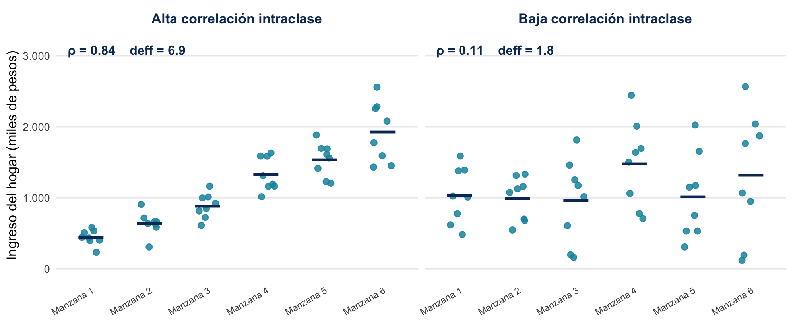

# Repaso: las dos decisiones del diseño

## Estratificar y conglomerar {.smaller}

Antes de seguir, recuperemos las dos decisiones que estructuran cualquier diseño muestral complejo. Van en direcciones opuestas y responden a problemas distintos.

::: {style="font-size:0.88em;"}
| | **Estratificar** | **Conglomerar** |
|:---|:---|:---|
| **Qué se hace** | dividir el marco en grupos y muestrear en cada uno | seleccionar conglomerados y entrevistar dentro de ellos |
| **Por qué** | asegurar todos los grupos y estimar en cada uno | concentrar el terreno y abaratar el desplazamiento |
| **Qué exige** | información auxiliar en el marco | un marco de áreas o listas agrupadas |
| **Efecto en la varianza** | puede reducirla | la aumenta si las unidades se parecen |
:::

Casi todas las encuestas de hogares usan **las dos a la vez**.

## Por qué conglomerar cuesta precisión {.smaller}

La razón es que las personas de un mismo conglomerado **se parecen entre sí**: comparten barrio, servicios, nivel socioeconómico. Esa similitud se mide con la **correlación intraclase** $\rho$.

Cuando $\rho > 0$, cada entrevista adicional dentro del mismo conglomerado aporta **menos información nueva** que una entrevista en un lugar distinto. Con conglomerados de tamaño parecido, el costo se aproxima así:

$$\text{deff} = 1 + \rho\,(b - 1)$$

donde $b$ es el número de entrevistas por conglomerado.

::: {style="border-radius:0.7em;padding:0.8em 1em;background-color:#f2f2f2;font-size:0.85em;"}
Con $\rho = 0{,}05$, entrevistar 10 viviendas por UPM da un deff de 1,45; entrevistar 20 lo sube a 1,95. Más entrevistas en menos lugares sale más barato en terreno y más caro en precisión. Dónde conviene pararse en ese intercambio depende de $\rho$ y de los costos relativos de cada UPM y de cada entrevista.
:::

# El efecto diseño en la práctica

## Qué mide exactamente el deff {.smaller}

El **efecto diseño** compara la varianza real de una estimación bajo el diseño complejo con la que tendría bajo un MAS del mismo tamaño:

$$\text{deff} = \frac{V_{\text{diseño complejo}}}{V_{\text{MAS}}}$$

Dos lecturas equivalentes:

::: {style="font-size:0.9em;"}
- **Como rendimiento:** el **tamaño muestral efectivo** es $n_{\text{efectivo}} = n / \text{deff}$. Una muestra de 5.000 con deff 2 *rinde* como un MAS de 2.500.
- **Como factor de inflación:** cuántas veces hay que **agrandar** la muestra compleja para lograr la precisión que daría un MAS. Así lo usa el INE para dimensionar la Casen.
:::

En él se acumulan los efectos de todo lo visto: conglomeración, estratificación y ponderadores desiguales. Por eso es un resumen de la eficiencia de un diseño.

## Estratificar no siempre baja el deff {.smaller}

El deff observado es el **neto** de dos decisiones que tienen efectos diferentes sobre la varianza. Ya vimos que conglomerar siempre la aumenta cuando $\rho > 0$. Con la estratificación el efecto es ambiguo:

::: {style="font-size:0.95em;"}
- Muestrear dentro de grupos definidos de antemano elimina la mala suerte de que una realización deje fuera a un grupo entero.
- Pero el deff de un diseño estratificado puede ser **menor, igual o incluso mayor que 1**, y lo que decide es la **asignación** de la muestra entre estratos.
- La asignación **proporcional** —misma fracción de muestreo en cada estrato— es el caso benigno de referencia. Sobremuestrear regiones pequeñas, como hace la Casen para poder estimar en cada una, mejora la precisión regional y **empeora** la nacional.
:::

## El deff es una propiedad de cada estimación {.smaller}

Un error frecuente: hablar de "el" efecto diseño de una encuesta. El deff depende de $\rho$, y $\rho$ **cambia según la variable**:

::: {style="font-size:0.9em;"}
- variables muy segregadas territorialmente, como la pobreza o el acceso a servicios, tienen $\rho$ alto y por lo tanto deff alto;
- variables que varían dentro de cualquier barrio, como el sexo o la edad, tienen $\rho$ bajo y deff cercano a 1.
:::

## Dos escenarios de correlación intraclase {.smaller}

Seis manzanas, ocho hogares encuestados en cada una. Los puntos son hogares; la línea, el promedio de la manzana.

## Cómo leer el ejemplo {.smaller}

::: {style="font-size:0.95em;"}
- **A la izquierda**, las manzanas se diferencian mucho entre sí y son homogéneas por dentro: saber en qué manzana está un hogar dice casi todo sobre su ingreso. Con $\rho = 0{,}84$ y ocho hogares por manzana, el deff llega a **6,9**.
- **A la derecha**, todas las manzanas tienen promedios parecidos y la variación está dentro de ellas: la manzana no informa sobre el ingreso del hogar. Con $\rho = 0{,}11$, el deff baja a **1,8**.
:::

::: {style="border-radius:0.7em;padding:0.8em 1em;background-color:#f2f2f2;font-size:0.9em;"}
Con la misma muestra y el mismo diseño, el costo en precisión es casi cuatro veces mayor en un caso que en el otro. Lo que cambia es la variable: el ingreso se parece al escenario de la izquierda, y el sexo o la edad, al de la derecha.
:::

## El deff de la pobreza en la Casen {.smaller}

Para la **tasa de pobreza por ingresos**, calculada sobre la base de **personas**:

::: {style="font-size:0.9em;"}
| | deff nacional | rango regional |
|:---|:---:|:---:|
| Casen 2022 (parámetro usado para diseñar la 2024) | 6,8 | 4,5 a 14,6 |
| Casen 2024 (estimado con los microdatos publicados) | 6,2 | 3,9 a 9,6 |
:::

## Qué significa en tamaño efectivo {.smaller}

Las **218.260 personas** de la Casen 2024 rinden, para estimar pobreza, como un muestreo aleatorio simple de unas **35.000 personas**.

::: {style="border-radius:0.7em;padding:0.8em 1em;background-color:#f2f2f2;font-size:0.9em;"}
Y esa cifra se puede contrastar con el propio diseño. El INE dimensionó la muestra para alcanzar la precisión de un MAS de **35.821 personas**: el tamaño efectivamente logrado coincide casi exactamente con el que se había propuesto. El deff es un parámetro con el que se **dimensiona** la muestra desde el principio del diseño.
:::

## Cómo interpretar un deff reportado {.smaller}

Al revisar los efectos de diseño que reporta la documentación de una encuesta, conviene establecer cuatro cosas:

::: {style="font-size:0.92em;"}
1. **A qué estimación corresponde.** Un deff sin la variable asociada no es interpretable, porque su valor depende de la variable.
2. **Sobre qué unidad y a qué nivel se calculó.** Personas o viviendas, nacional o regional: los valores son distintos y no son intercambiables.
3. **Cuál es el tamaño efectivo** ($n / \text{deff}$). Es la cifra que permite comparar encuestas con diseños distintos: una de 3.000 casos con deff 1,2 equivale a más información que una de 5.000 con deff 3.
4. **Cuál es el efecto sobre los intervalos.** Como el error estándar crece con la raíz del deff, un valor de 4 duplica el ancho del intervalo de confianza y uno de 2 lo aumenta en torno al 41%.
:::

# Del deff al tamaño muestral

## La receta del tamaño muestral {.smaller}

¿Cómo se llega a "74.668 viviendas"? La metodología que el INE usa para la Casen sigue una cadena de ajustes que ustedes ya pueden leer completa:

::: {style="font-size:0.9em;"}
1. **Partir del MAS:** calcular el tamaño que necesitaría un MAS para el error máximo tolerable en el parámetro clave (la tasa de pobreza), usando los resultados de campo de la ronda anterior.
2. **Ajustar por efecto diseño:** multiplicar por el deff observado en la ronda anterior (6,8 nacional) — el diseño complejo necesita más casos para la misma precisión.
3. **Ajustar por finitud** de la población (una corrección menor).
4. **Ajustar por no logro:** inflar por la tasa de no respuesta esperada, también tomada de la ronda anterior → el **sobremuestreo**.
:::

## El resultado de la cadena {.smaller}

En la Casen 2024, la cadena termina así:

::: {style="font-size:0.95em;"}
- tamaño objetivo: **71.121** viviendas;
- ajustado: **74.668**;
- con sobremuestreo: **112.448 viviendas seleccionadas**, con 8 viviendas por UPM urbana y 10 por UPM rural.
:::

::: {style="border-radius:0.7em;padding:0.8em 1em;background-color:#f2f2f2;font-size:0.9em;"}
Cada número de la cadena viene de un dato **empírico de la ronda anterior**: los diseños se alimentan del campo pasado. Una encuesta nueva, sin rondas previas, debe buscar esos parámetros en otra fuente, como hizo el estudio de marcos de la ENA, que los tomó de la Casen 2022.
:::

# Construcción de ponderadores

## Qué es un factor de expansión {.smaller}

Cada caso de la muestra entra al análisis con un **peso**: el número de unidades de la población que ese caso representa. Cuando la suma de los pesos reproduce el total de la población, se habla de **factor de expansión**, porque la muestra se expande al tamaño poblacional.

::: {style="font-size:0.92em;"}
- El factor no es un accesorio del análisis: es parte del diseño. Una encuesta con probabilidades de selección desiguales solo produce estimaciones poblacionales correctas si se lo incorpora.
- Por eso las bases de microdatos lo traen como una columna, y todo análisis debe usarlo, incluso para calcular un promedio simple.
:::

## La cadena de ajustes {.smaller}

El factor publicado no sale directo del diseño. Entre la selección y la base final hay una **secuencia de ajustes**, cada uno con su propósito:

::: {style="font-size:0.86em;"}
| Paso | Qué corrige |
|:---|:---|
| **1. Ponderador base** | las probabilidades desiguales de selección del diseño |
| **2. Elegibilidad** | unidades del marco que no pertenecían a la población objetivo |
| **3. No contacto** | unidades elegibles a las que nunca se logró llegar |
| **4. No respuesta** | unidades contactadas que no participaron |
| **5. Suavizamiento** | pesos extremos que inflan la varianza |
| **6. Calibración** | desajuste con totales poblacionales conocidos |
| **7. Redondeo** | factores no enteros, cuando se requiere |
:::

## No toda encuesta lleva todos los pasos {.smaller}

Cuál de los siete pasos se aplica depende del **diseño** de la encuesta y de **lo que ocurrió en terreno**:

::: {style="font-size:0.95em;"}
- una encuesta sin problemas de elegibilidad se salta el paso 2;
- una que distingue el no contacto del rechazo hace los pasos 3 y 4 por separado; otras los tratan juntos;
- el suavizamiento solo se aplica si aparecen pesos extremos;
- el redondeo depende de cómo se entregue la base.
:::

::: {style="border-radius:0.7em;padding:0.8em 1em;background-color:#f2f2f2;font-size:0.9em;"}
Lo común a todas es el **orden**: los ajustes se aplican en cadena, cada uno sobre el resultado del anterior. Por eso la documentación de una encuesta describe una secuencia, y no una lista de correcciones sueltas.
:::

## El ponderador base {.smaller}

El punto de partida es el inverso de la probabilidad de selección de cada unidad:

$$w_i = \frac{1}{\pi_i}$$

Si una vivienda tenía una posibilidad en 500 de ser seleccionada, representa a 500 viviendas como la suya.

Este ponderador se deduce enteramente del **diseño**: se conoce antes de salir a terreno, porque depende de decisiones ya tomadas — estratos, etapas, probabilidad proporcional al tamaño, sobremuestreo. Todo lo que viene después corrige aquello que el terreno agregó.

## Ajustes por elegibilidad, contacto y respuesta {.smaller}

Los tres pasos corrigen el mismo tipo de problema: unidades seleccionadas que no entregaron dato. La lógica común es **redistribuir el peso de las unidades ausentes entre las presentes que se les parecen**.

**Ajuste simple por celdas.** Las unidades se agrupan según una variable disponible en el marco, como el estrato, la región o el área, y dentro de cada celda el peso de las que no respondieron se reparte entre las que sí. Es transparente y fácil de documentar, pero solo aprovecha la variable con que se construyeron las celdas.

## Ajuste mediante modelo de propensión {.smaller}

La alternativa es estimar con un modelo la probabilidad de responder de cada unidad, a partir de varias variables simultáneamente. Después las unidades se agrupan por nivel de propensión —en deciles o veintiles, por ejemplo— y el ajuste se aplica dentro de cada grupo.

Su ventaja es poder usar toda la información auxiliar disponible a la vez, incluidas variables del propio operativo de terreno, y no solo la variable de agrupación.

::: {style="border-radius:0.7em;padding:0.8em 1em;background-color:#f2f2f2;font-size:0.9em;"}
Ambos procedimientos descansan en el mismo supuesto: que dentro de cada celda o grupo, quienes respondieron se parecen a quienes no respondieron. Ese supuesto no se puede verificar con los datos de la propia encuesta.
:::

## Suavizamiento {.smaller}

Los ajustes anteriores pueden dejar pesos muy grandes, cuando una unidad queda representando a muchas que no respondieron. Esos pesos extremos aumentan la varianza de las estimaciones.

El suavizamiento los acota: los factores atípicos se recortan o se contraen hacia el promedio, de modo que el rango se estreche.

::: {style="border-radius:0.7em;padding:0.8em 1em;background-color:#f2f2f2;font-size:0.9em;"}
El intercambio es explícito: se acepta algo de sesgo a cambio de estimaciones más estables. Por eso el paso solo se aplica cuando el diagnóstico muestra pesos atípicos, y no de rutina.
:::

## Calibración y redondeo {.smaller}

**Calibración.** Es el último ajuste sustantivo: modifica los factores para que reproduzcan **totales poblacionales conocidos**, como la población por región, sexo y tramo de edad, tomados de proyecciones o de registros administrativos. Dos procedimientos habituales son la **postestratificación**, que ajusta a los totales de celdas cruzadas, y el **raking**, que ajusta de forma iterativa a los márgenes de varias variables a la vez.

Lo que la calibración aporta es coherencia con las cifras poblacionales de referencia y, en la medida en que las variables de calibración se asocien con lo que se mide, una reducción del sesgo de cobertura y de no respuesta.

**Redondeo.** Paso final y menor: cuando la base se entrega con factores enteros, se redondea sin alterar los totales.

## ELPI 2024: la cadena en un panel {.smaller}

La **cuarta ronda de la ELPI** (2024) sigue a los mismos niños y niñas desde 2010, y permite ver la cadena aplicada a un panel.

::: {style="font-size:0.9em;"}
- **Ponderador base heredado.** Se replicó la muestra lograda en 2010 (15.175 niños y niñas), sin muestra de refresco. Como no hubo nueva selección, se reutilizó el ponderador de 2010.
- **No contacto con modelo de propensión.** Un modelo logit estima la probabilidad de ser contactado, con predictores del hogar, del niño y también del **encuestador**; las probabilidades se agrupan en deciles y el ajuste se aplica dentro de cada uno.
- **No respuesta con ajuste simple por estrato**, sobre quienes sí fueron contactados.
:::

::: {style="border-radius:0.7em;padding:0.8em 1em;background-color:#f2f2f2;font-size:0.85em;"}
Que la **edad del encuestador** prediga el contacto muestra algo que la unidad 4 desarrollará: la no respuesta es un resultado del proceso de terreno, y no solo un atributo del respondente.
:::

## ELPI 2024: suavizamiento y calibración {.smaller}

::: {style="font-size:0.9em;"}
- **Suavizamiento.** Terminado el ajuste por no respuesta se identificaron **1.129 factores atípicos**. Tras la contracción, el rango de los factores pasó de **44,08–147,42** a **46,14–129,6**.
- **Calibración.** Se ajustó a los totales de niños y niñas por región, cohorte de nacimiento y sexo. Esos totales no venían de una proyección: se construyeron con los registros del Servicio de Registro Civil y del MINSAL, descontando las defunciones.
:::

::: {style="border-radius:0.7em;padding:0.8em 1em;background-color:#f2f2f2;font-size:0.85em;"}
La población de referencia son los nacidos entre enero de 2006 y agosto de 2009 **que siguen vivos** al momento del cálculo. En un panel de catorce años, la mortalidad de la cohorte forma parte del marco de calibración.
:::

## Casen 2024 {.smaller}

La Casen recorre la secuencia con decisiones propias, porque su diseño y sus problemas de campo son otros. Los pasos que aplica son:

::: {style="font-size:0.88em;"}
- **Ponderador base**, a partir de las probabilidades de selección de UPM y viviendas.
- **Elegibilidad**, paso que la ELPI 2024 no necesitó. De 102.452 viviendas elegibles respondieron **77.618** (75,8%).
- **No respuesta** con modelo de propensión, estimado a nivel de **UPM** y agrupado en **veintiles**. El logro entre veintiles va de **37,6% a 97,7%**.
- **Calibración** por *raking* a totales de población, con control regional.
- **Redondeo probabilístico** para entregar factores enteros.
:::

## Consecuencias de no ponderar y costos de ponderar {.smaller}

**Sin ponderar:** la Casen sobremuestrea las regiones pequeñas para poder estimarlas. Sin factores de expansión, Aysén y Magallanes pesan varias veces su peso real, y cualquier variable asociada al territorio sale distorsionada a nivel nacional.

**Ponderar también tiene precio:**

::: {style="font-size:0.9em;"}
- pesos muy **desiguales** aumentan la varianza, y eso es parte del deff que vimos;
- los ajustes por no respuesta y calibración descansan en **supuestos** no verificables;
- por eso los pesos extremos suelen **recortarse**, cambiando algo de sesgo por estabilidad.
:::

## La varianza se estima con el diseño {.smaller}

Última pieza del cierre: el **margen de error** de una encuesta compleja no sale de la fórmula del MAS. Estimar la varianza exige incorporar estratos, conglomerados y pesos:

::: {style="font-size:0.9em;"}
- el método estándar es la **linearización de Taylor** (el que usó el estudio de marcos de la ENA); las alternativas son métodos de **replicación**;
- en la práctica lo hace el software: los paquetes `survey` / `srvyr` en R, o los comandos `svy` de Stata;
- por eso las bases de microdatos traen columnas de **estrato, conglomerado y factor de expansión**: son las instrucciones para calcular bien la incertidumbre.
:::

::: {style="border-radius:0.7em;padding:0.8em 1em;background-color:#f2f2f2;font-size:0.85em;"}
Más adelante en el curso aprenderemos a usar estas herramientas sobre microdatos reales. Por ahora basta con entender por qué esas tres columnas existen y qué se pierde al ignorarlas.
:::

# Síntesis

## Síntesis: el efecto diseño {.smaller}

::: {style="font-size:0.95em;"}
1. El **efecto diseño** resume la eficiencia de un diseño complejo: cuánta varianza extra se paga respecto de un MAS del mismo tamaño. Su inverso da el **tamaño efectivo**: las 218.260 personas de la Casen 2024 rinden, para la pobreza, como un MAS de unas 35.000.
2. El deff es propiedad de **cada estimación**, no de la encuesta: depende de cuán agrupada esté la variable ($\rho$) y del tamaño de los conglomerados ($b$). Y también de la **unidad**: la misma tasa de pobreza da 6,8 en personas y 1,7 en viviendas.
3. El **tamaño muestral** se construye en cadena, del MAS al deff, la finitud y el no logro esperado, con parámetros empíricos de rondas anteriores: los diseños se alimentan del campo pasado.
:::

## Síntesis: los ponderadores {.smaller}

::: {style="font-size:0.95em;"}
4. Los **ponderadores** devuelven el equilibrio que el diseño desbalanceó, mediante una **cadena de ajustes**: peso base, elegibilidad, no contacto, no respuesta, suavizamiento, calibración y redondeo.
5. **No toda encuesta lleva todos los pasos.** La ELPI 2024 heredó su ponderador base del panel de 2010 y no necesitó ajuste de elegibilidad; la Casen sí lo aplica, y modela la no respuesta por veintiles de UPM. Lo común es el orden: cada ajuste se aplica sobre el resultado del anterior.
6. Sin ponderadores, la base describe a la muestra y no a la población. Con ellos se paga varianza y se asumen supuestos, y por eso cada paso se documenta.
7. La **varianza se estima con el diseño** (Taylor, replicación): estrato, conglomerado y factor de expansión son las columnas que lo hacen posible.
:::

## Próxima clase {.smaller}

La próxima semana abrimos la **Unidad 3** y cambiamos de rama del TSE: de la representación a la **medición**:

- el **proceso de respuesta**: qué pasa en la cabeza de una persona entre escuchar la pregunta y dar la respuesta;
- y la **construcción de escalas y operacionalización**: del concepto al ítem.

::: {style="border-radius:0.7em;padding:0.8em 1em;background-color:#f2f2f2;font-size:0.9em;"}
📌 La **pauta del proyecto grupal** ya está disponible en la página del curso. La **Entrega 1** vence el **viernes 25 de septiembre**.
:::

📖 **Lecturas de esta semana:** Groves et al. (2009), cap. 4 (secciones de estratificación, conglomerados y complicaciones en la práctica); UNSD (2026), *Handbook*, cap. 5 (sección 5.4, "Sampling").
