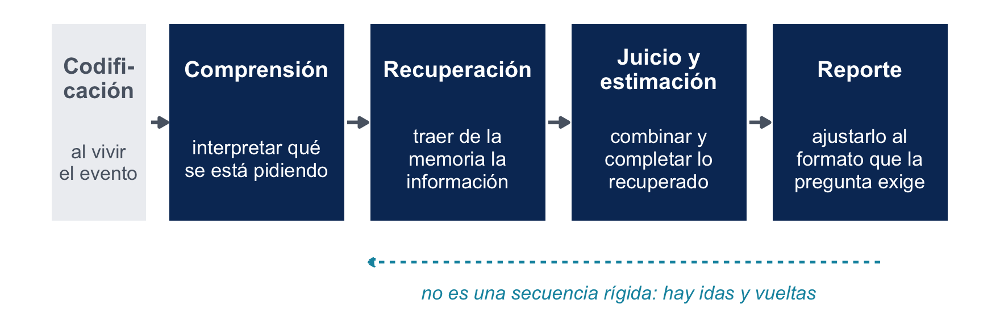
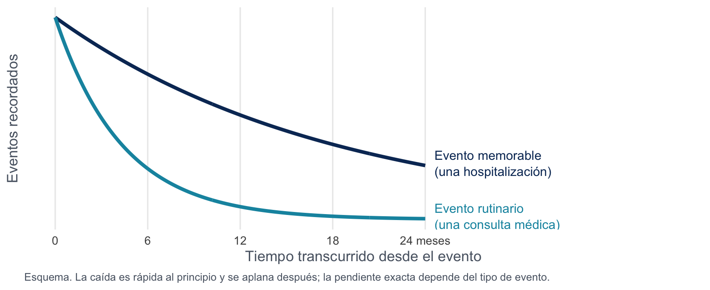
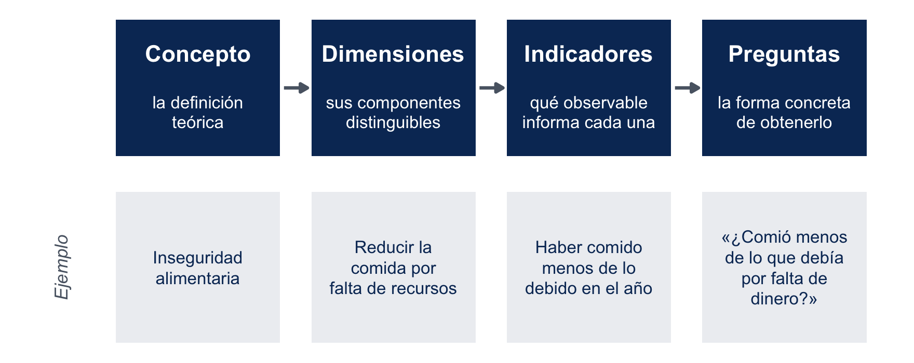
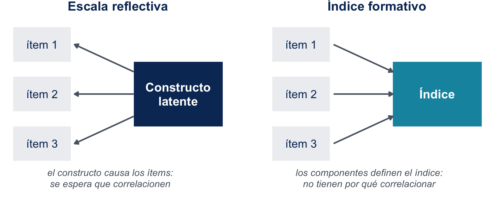

# La respuesta no es un dato que se recoge

## Qué cuenta como trabajo {.smaller}

Una pregunta aparentemente simple:

::: {style="border-radius:0.7em;padding:0.9em 1.1em;background-color:#f2f2f2;font-size:1.1em;"}
*"¿Trabajó usted la semana pasada?"*
:::

La respuesta depende de qué entienda cada persona por "trabajar", y de cuánto trabajo le parezca suficiente para decir que sí:

- ¿cuenta cocinar para la familia, o cuidar a un padre enfermo?
- ¿ayudar sin sueldo en el negocio familiar?
- ¿basta con un par de horas, o tiene que ser una jornada?

Dos personas con la misma semana pueden responder "sí" y "no", y ninguna está mintiendo.

## Cómo resuelve esa ambigüedad un cuestionario real {.smaller}

Así abre la secuencia con que la Casen clasifica a los ocupados:

::: {style="border-radius:0.7em;padding:0.9em 1.1em;background-color:#f2f2f2;font-size:1.05em;"}
*"La semana pasada, ¿trabajó al menos una hora, sin considerar los quehaceres del hogar?"*

Cuestionario Casen 2024, módulo Trabajo, pregunta o1.
:::

Cada cláusula es una decisión de medición:

- un **umbral**: "al menos una hora";
- una **ventana**: "la semana pasada";
- una **exclusión explícita**: los quehaceres del hogar no cuentan.

## El plan de hoy {.smaller}

::: {style="border-radius:0.7em;padding:0.9em 1.1em;background-color:#f2f2f2;"}
**La respuesta rara vez está guardada en la cabeza del respondente esperando ser recogida.** En mayor o menor grado según la pregunta, se construye en el momento, con la pregunta como materia prima.
:::

 

Las semanas 3 a 5 resolvieron *a quién* le preguntamos: la columna de representación del TSE. Desde hoy entramos en la de medición, **qué pasa cuando preguntamos**, por dos trayectos y en este orden:

1. el del **respondente**, de la pregunta a la respuesta;
2. el del **diseño**, del concepto a la pregunta.

# El modelo del proceso de respuesta

## El proceso de respuesta en cuatro etapas {.smaller .nostretch}

Los modelos que sistematiza Groves distinguen cuatro grupos de procesos, más uno que ocurre antes de la entrevista:

{fig-align="center" width="92%"}

::: {style="font-size:0.95em;"}
Recorreremos cada etapa: qué hace el respondente en ella, y después qué sale mal.
:::

## Una pregunta de ejemplo {.smaller}

Usaremos el mismo ítem que usa Groves, de la encuesta estadounidense de consumo de drogas (NSDUH):

::: {style="border-radius:0.7em;padding:0.9em 1.1em;background-color:#f2f2f2;"}
*"Ahora piense en los últimos 12 meses, desde [FECHA] hasta hoy. Queremos saber cuántos días usó algún tranquilizante recetado que no le hubieran recetado a usted, o que haya tomado solo por la experiencia o la sensación que produce."*
:::

Exige las cuatro cosas a la vez: entender una definición larga, recordar episodios poco memorables, construir un número y decidir cuánto declarar sobre una conducta estigmatizada.

::: {style="font-size:0.9em;color:#5A6472;"}
Dos advertencias: las etapas no son una secuencia rígida, y los respondentes con frecuencia se saltan alguna o la ejecutan a medias (*satisficing*).
:::

## Etapa 1. Comprensión {.smaller}

**Qué hace el respondente:** prestar atención a la pregunta y a sus instrucciones, asignarle un significado y deducir qué información se le está pidiendo.

 

En el ítem del ejemplo tiene que resolver, entre otras cosas:

- qué es exactamente un "tranquilizante recetado";
- qué significa "que no le hubieran recetado a usted": ¿un remedio de un familiar?, ¿uno propio pero vencido?;
- qué cuenta como "cuántos días": ¿días distintos, o veces?

 

En modos autoadministrados se agrega una tarea más: interpretar la **navegación**, es decir, qué pregunta viene después y qué hacer con las instrucciones.

## Etapa 2. Recuperación {.smaller}

**Qué hace el respondente:** traer desde la memoria de largo plazo la información relevante, a partir de las pistas que le da la propia pregunta.

 

Las pistas están escritas en el enunciado, aunque no lo parezca:

- el **período de referencia** ("los últimos 12 meses, desde [FECHA]") acota qué buscar;
- los **términos** con que se nombra el evento activan o no el recuerdo;
- los **ejemplos** que a veces incluye la pregunta funcionan como llaves de acceso.

 

Por eso una pregunta bien escrita no solo es clara: también está diseñada para gatillar el recuerdo correcto.

## Etapa 3. Estimación y juicio {.smaller}

**Qué hace el respondente:** combinar y completar lo que recuperó. Casi nadie tiene la cifra lista, así que hay que construirla.

 

Groves muestra tres respondentes que llegan a tres respuestas por caminos distintos:

::: {style="font-size:0.95em;"}
- uno **enumera** los episodios que recuerda y los suma;
- otro razona por **tasa**: "más o menos una vez al mes, así que 12";
- otro traduce una **impresión** vaga: "unas pocas veces, digamos 5".
:::

 

En preguntas de actitud la tarea es equivalente: formar una valoración con las consideraciones que la pregunta trajo a la mente.

## Etapa 4. Reporte {.smaller}

**Qué hace el respondente:** seleccionar y comunicar la respuesta. Dos tareas distintas se esconden ahí:

::: {style="font-size:0.95em;"}
1. **Ajustar el juicio al formato** que la pregunta exige: elegir una de las categorías ofrecidas, decidir un número, ubicarse en una escala.
2. **Editar la respuesta** antes de decirla: por coherencia con lo que ya respondió, por lo que le parece aceptable declarar, o por lo que cree que el entrevistador espera.
:::

 

En el ítem del ejemplo, la segunda tarea pesa: se trata de una conducta estigmatizada y hay alguien escuchando.

## Antes de todo: la codificación {.smaller}

Hay un quinto proceso, y ocurre **antes de la encuesta**: la **codificación**, es decir, la formación del recuerdo cuando la persona vive el evento.

Vivir algo no implica registrarlo. Un estudio clásico comparó reportes de alimentación en encuesta contra diarios detallados de los mismos respondentes: la coincidencia era tan pobre que el autor concluyó que los reportes eran, en buena parte, **conjeturas sobre lo que probablemente comieron**.

::: {style="border-radius:0.7em;padding:0.9em 1.1em;background-color:#f2f2f2;"}
**Ninguna pregunta, por bien escrita que esté, puede extraer información que nunca se codificó.** Cuando el diseño sospecha que ese es el caso, la solución no es mejor redacción: es otro instrumento, como un diario, un registro que el hogar ya lleve o una medición directa.
:::

El diseñador no controla la codificación, pero sí puede diseñar a favor de ella: preguntar en los términos en que la gente realmente vivió y nombró la experiencia.

# Fuentes de error en cada etapa

## Comprensión: interpretaciones múltiples {.smaller}

Pedirle a respondentes que expliquen qué entendieron por los términos de preguntas reales revela interpretaciones distintas incluso para palabras cotidianas.

::: {style="font-size:0.95em;"}
- **"hijos"**: ¿cuentan los de su pareja?, ¿los que ya no viven con usted? **"ingreso"**: ¿líquido o bruto?, ¿solo el sueldo, o también bonos y arriendos?
- **Términos vagos** ("frecuentemente", "servicios de salud") y **técnicos** sin definir: el diseñador sobreestima el vocabulario compartido.
- **Complejidad excesiva:** tantas instrucciones que el respondente no retiene todos los requisitos.
- **Presuposiciones:** la pregunta asume algo que para el respondente no es cierto.
- **Inferencias sobre la intención:** se contesta a lo que la pregunta parece *querer* saber.
:::

Y casi nadie pide aclaración: en estudios sobre un tema **inventado**, hasta un **40%** igual dio su opinión (Bishop, Oldendick y Tuchfarber, 1986).

## Recuperación: el olvido {.smaller}

El hallazgo más robusto de más de un siglo de investigación sobre memoria: el olvido crece con el tiempo transcurrido, rápido al principio y más lento después.

{fig-align="center" width="82%"}

## Recuperación: otras fallas de la memoria {.smaller}

El olvido por paso del tiempo no es la única falla:

::: {style="font-size:0.95em;"}
- **Memoria genérica:** los eventos similares se funden. La visita específica al consultorio se vuelve "una visita típica"; cuantos más eventos parecidos, más difícil recordar uno en particular.
- **Desajuste de términos:** si la pregunta nombra el evento distinto de como el respondente lo codificó, no gatilla el recuerdo. Quien no piensa su copa de vino como "bebida alcohólica" no la reporta.
- **Reconstrucción:** los vacíos se rellenan con "lo que suele pasar", o proyectando el presente hacia atrás y suponiendo que la conducta fue estable.
:::

 

Las tres empujan en direcciones distintas, y ninguna es un error del respondente: son propiedades de cómo funciona la memoria.

## Recuperación: el telescoping {.smaller}

Los eventos no solo se olvidan: también **se corren en el tiempo**. Típicamente hacia el presente, de modo que se reportan eventos ocurridos *antes* del período preguntado.

 

::: {style="border-radius:0.7em;padding:0.9em 1.1em;background-color:#f2f2f2;"}
En el estudio clásico del tema, cerca del **40%** de los trabajos de reparación del hogar reportados estaban mal reportados por telescoping.

Neter y Waksberg (1964), que variaron a la vez el largo del período de referencia (1, 3 o 6 meses) y si la entrevista estaba anclada a la anterior.
:::

 

Como el telescoping agrega eventos y el olvido los quita, el sesgo neto de una pregunta depende de cuál de los dos domine: no es predecible solo mirando la redacción.

## Qué hace el diseño contra las fallas de memoria {.smaller}

::: {style="font-size:0.95em;"}
- **Más y mejores pistas de recuerdo** dentro de la pregunta: ejemplos de la categoría, nombres alternativos del evento.
- **Períodos de referencia ajustados a la memorabilidad** del evento: un año para hospitalizaciones, semanas para consultas de rutina.
- **Calendario de historia de vida:** se registran primero hitos personales (mudanzas, empleos, nacimientos) y esos hitos sirven después como anclas para fechar y recordar lo demás.
- **Consulta de registros:** pedirle al respondente que revise boletas, recetas o cartolas antes de responder.
:::

## Contra el telescoping: anclar la entrevista en la anterior {.smaller}

En encuestas panel existe un procedimiento específico, que en inglés se llama *bounding*:

::: {style="border-radius:0.7em;padding:0.9em 1.1em;background-color:#f2f2f2;"}
Antes de preguntar por el período nuevo, el entrevistador **le lee al respondente el resumen de lo que declaró en la ronda anterior**. Solo se cuentan los eventos posteriores a esa entrevista.
:::

La ronda anterior funciona como un piso: el respondente reconoce lo que ya contó y no vuelve a contarlo.

Es el procedimiento estándar de la encuesta de victimización estadounidense (NCVS), que entrevista a los mismos hogares cada seis meses. Su costo es evidente: requiere un panel, así que no está disponible para una encuesta transversal.

## Estimación: tres estrategias, tres errores {.smaller}

Ante "¿cuántas veces…?", casi nadie tiene una cuenta llevada. Las tres estrategias que vimos fallan de manera distinta:

::: {style="font-size:0.95em;"}
1. **Recordar y contar.** Funciona con pocos eventos. Con muchos, omite (olvido) y agrega (telescoping) a la vez, y los respondentes tienden a abandonarla a medida que los eventos se acumulan.
2. **Estimar por tasa.** Tiende a **sobreestimar** cuando la conducta es irregular, porque toma un período representativo y lo proyecta.
3. **Traducir una impresión.** La más frágil, y la más sensible a lo que la pregunta le sugiera al respondente.
:::

::: {style="border-radius:0.7em;padding:0.8em 1.1em;background-color:#f2f2f2;font-size:0.95em;"}
Regla de lectura para el proyecto: ante una distribución de frecuencias reportadas, pregúntense **qué estrategia de estimación indujo la pregunta**. Es una hipótesis, no un diagnóstico: cuantificarla exige la evidencia de la próxima clase.
:::

## Juicio: las actitudes también se construyen {.smaller}

Podría pensarse que las actitudes son distintas, pero el proceso es análogo:

::: {style="border-radius:0.7em;padding:0.9em 1.1em;background-color:#f2f2f2;"}
**La mayoría de las personas no tiene opiniones preformadas** esperando ser recuperadas. Construyen el juicio en el momento, con las consideraciones que la pregunta y el contexto les traen a la mente.
:::

 

Algunos tienen una posición clara (quien sigue el mercado financiero responderá sin esfuerzo una pregunta sobre la economía del próximo año). La mayoría tiene una impresión vaga, o arma la respuesta en ese instante, sea desde valores generales o desde creencias específicas.

## Juicio: la formulación y el contexto mueven {.smaller}

Dos preguntas de los años cincuenta sobre la guerra de Corea:

::: {style="border-radius:0.7em;padding:0.7em 1.1em;background-color:#f2f2f2;font-size:0.9em;"}
*"¿Cree que Estados Unidos cometió un error al decidir defender Corea, o no?"* (Gallup)

*"¿Cree que Estados Unidos hizo bien o mal en enviar tropas **para detener la invasión comunista** de Corea del Sur?"* (NORC)
:::

La segunda mostró más apoyo. En experimentos posteriores, agregar "para detener una toma comunista" subió el apoyo en torno a **15 puntos** (Schuman y Presser, 1981).

El contexto también mueve: una pregunta de **felicidad general** se responde distinto si viene después de una sobre la satisfacción con la pareja.

Por eso, **comparar en el tiempo requiere preguntar igual**, y **leer una cifra de opinión requiere leer la pregunta textual y las que la acompañan**.

## Reporte: redondeo, escalas y orden {.smaller}

::: {style="font-size:0.95em;"}
- **Números abiertos:** los respondentes redondean. Las respuestas se apilan en múltiplos de cinco, y los porcentajes en 0, 50 y 100.
- **Escalas:** sesgo de positividad, evitación de los extremos, y efectos de las etiquetas numéricas. Una escala de −5 a +5 no rinde igual que una de 0 a 10 con las mismas etiquetas verbales.
- **Orden de las categorías:** los respondentes tienden a elegir la primera opción adecuada que consideran. **Primacía** cuando leen (modos visuales) y **recencia** cuando escuchan (modos auditivos). Volverá en la semana de modos.
- **Errores de navegación**, en autoadministrado: saltarse preguntas o responder las que no correspondían.
:::

## Reporte: el reporte motivado {.smaller}

Con temas sensibles (consumo de sustancias, ingresos, conductas estigmatizadas) el respondente ajusta la respuesta o calla.

::: {style="font-size:0.95em;"}
- La **deseabilidad social** produce subreporte de lo indeseable y sobrerreporte de lo deseable. El voto es el ejemplo clásico: en cualquier elección, más gente declara haber votado de la que efectivamente votó.
- En preguntas de **ingreso**, la no respuesta de ítem alcanza niveles varias veces superiores a los de cualquier pregunta demográfica.
:::

 

La táctica que la evidencia señala como más efectiva no es la redacción: es **reducir la presencia del entrevistador**. La autoadministración tiende a mejorar el reporte de lo sensible. Con matices, porque el modo óptimo varía según tema y contexto, y autoadministrar tiene sus propios costos. Es un resultado sobre modos, y lo desarrollaremos en la Unidad 4.

# Criterios para escribir preguntas

## Hechos: especificidad y vocabulario {.smaller}

De los problemas anteriores se derivan los criterios. Para preguntas conductuales y de hechos **no sensibles**:

::: {style="font-size:0.95em;"}
- **Especificidad:** dejar explícito quién cubre la pregunta, qué conductas y qué período de referencia. "¿Cuándo sale usted de su casa al trabajo?" es incontestable; "durante la última semana, ¿a qué hora salió habitualmente…?" no lo es.
- **Vocabulario universal:** términos que prácticamente todos entienden. Si un término técnico es inevitable, definirlo justo antes de preguntar.
- **Categorías completas y excluyentes:** lo que no aparece como opción explícita se subreporta, y lo agrupado en "otros" también.
:::

## Hechos: ayudas a la memoria {.smaller}

::: {style="font-size:0.95em;"}
- **Pistas de recuerdo** dentro de la pregunta, como ejemplos de la categoría.
- **Recuerdo asistido:** preguntar por subcategorías en vez de por el total.
- **Períodos de referencia** ajustados a la memorabilidad del evento.
- **Anclaje a la ronda anterior** en encuestas panel, contra el telescoping.
- Cuando ni la mejor pregunta puede con la memoria: **diarios** para eventos frecuentes y poco involucrantes, o **calendarios de historia de vida** para períodos largos.
:::

 

Nótese que casi todos son decisiones de **diseño del instrumento**, no de redacción de la frase.

## La ENUT: diseñar a favor del recuerdo {.smaller}

Un ejemplo chileno de esta lógica aplicada.

La ENUT no pregunta por una semana genérica. Le asigna a cada persona **dos días de referencia concretos**, uno de semana y uno de fin de semana.

Y antes de medir el uso del tiempo, **contextualiza cada día** con el respondente para activar el recuerdo:

- a qué hora se despertó;
- si almorzó y qué almorzó;
- si ocurrió algo fuera de su rutina.

Anclas de recuerdo primero; medición después.

## Preguntas sensibles {.smaller}

Al problema de memoria se le suma el reporte motivado, y por eso varios criterios apuntan a ambos a la vez:

::: {style="font-size:0.95em;"}
- preferir **autoadministración** para el módulo sensible;
- **formato abierto** antes que categorías, porque las categorías sugieren qué es "normal";
- preguntas **más largas** y con vocabulario cotidiano;
- partir por "¿alguna vez…?" antes de llegar al período reciente;
- **ubicar el ítem entre otros**, para restarle prominencia.
:::

 

Una advertencia: la redacción "comprensiva", que da razones válidas para la conducta, ayuda menos de lo que se cree. Reduce el sesgo, pero no lo elimina.

## Preguntas de actitud {.smaller}

Aquí el problema es el juicio construido en el momento:

::: {style="font-size:0.95em;"}
- **Objeto claro** y una sola pregunta por ítem, sin preguntas dobles.
- Escalas de **5 a 7 puntos, todas etiquetadas**, balanceadas, con punto medio salvo razón fuerte en contra.
- Preferir preguntas **específicas del constructo** por sobre baterías acuerdo/desacuerdo, que invitan a la **aquiescencia**.
- Lo **general antes que lo específico**, y para medir cambio, **la misma pregunta cada vez**.
:::

::: {style="border-radius:0.7em;padding:0.8em 1.1em;background-color:#f2f2f2;font-size:0.95em;"}
Los criterios **chocan entre sí**: especificar bien el objeto puede volver la pregunta compleja, y el punto medio le da salida honesta al ambivalente y también al que no quiere pensar. Dejan la pregunta lista para **probarse**, no lista para aplicarse. Ese es el tema de la próxima clase.
:::

# Del concepto a la pregunta

## La cadena de la operacionalización {.smaller .nostretch}

Cambiemos de asiento: del respondente al equipo que diseña. Su tarea no es responder una pregunta, sino **representar un concepto** con preguntas.

{fig-align="center" width="80%"}

::: {style="font-size:0.9em;"}
Antes del primer eslabón están los **objetivos y el plan de análisis**: qué se quiere saber y qué se hará con el dato.
:::

## Dónde se juega la validez {.smaller}

Cada eslabón de esa cadena es una decisión discutible, y en ella se juega la **validez** de la medición que definimos en la semana 2.

::: {style="border-radius:0.7em;padding:0.9em 1.1em;background-color:#f2f2f2;"}
Si los indicadores no representan bien el concepto, se termina midiendo **con precisión otra cosa**.
:::

La validez no se "ve" en la cadena: se evalúa después, con evidencia. Pero cada eslabón mal resuelto la compromete de antemano, y además **le impone tareas cognitivas al respondente**:

::: {style="font-size:0.95em;"}
- una dimensión mal definida se vuelve una pregunta incomprensible;
- un indicador que exige recordar lo irrecordable se vuelve una estimación por impresión;
- una escala mal elegida se vuelve un reporte forzado.
:::

## La operacionalización como traducción {.smaller}

Asún describe la misma cadena como una **traducción**: del lenguaje teórico del investigador al habla en que las personas pueden expresar el concepto.

 

La primera decisión es si la traducción es necesaria:

::: {style="font-size:0.95em;"}
- Un **concepto simple** vive en el habla cotidiana con un significado compartido. Se pregunta directo: "¿cuántos años tiene?".
- Un **concepto complejo** no existe en el habla de la población, o no como lo entiende el investigador. Nadie puede responder "¿cuán individuado está usted?": hay que desagregarlo hasta llegar a dimensiones *preguntables*.
:::

## Un ejemplo chileno de la cadena {.smaller}

El caso que usa Asún: el Informe de Desarrollo Humano del PNUD (2002) midió la **individuación** con tres dimensiones:

::: {style="font-size:0.95em;"}
1. disposición a romper normas sociales;
2. deberes morales percibidos;
3. la biografía como decisión propia.
:::

 

Cada dimensión se resolvió en preguntas concretas y el conjunto se combinó en un índice. Una de la primera dimensión:

::: {style="border-radius:0.7em;padding:0.8em 1.1em;background-color:#f2f2f2;font-size:1.0em;"}
*"¿Está dispuesto a seguir adelante con una idea aunque vaya en contra de la opinión de sus padres?"*
:::

## Los límites de toda operacionalización {.smaller}

::: {style="font-size:1.0em;"}
**Preguntar también produce.** Plantearle grados de satisfacción a quien nunca se lo había preguntado no recoge una opinión: la *cristaliza* en ese momento. Por eso un cuestionario «produce información», no solo la recoge.
:::

 

::: {style="font-size:1.0em;"}
**Toda operacionalización distorsiona.** Implica, en palabras de Asún, «un grado de distorsión o mutilación del sentido teórico» del concepto. Nunca se mide el concepto completo, solo mejores o peores interpretaciones empíricas de él.
:::

## Reusar, adaptar o crear {.smaller}

Escribir una pregunta desde cero es solo una de **tres estrategias**, y no la primera que se considera:

::: {style="font-size:0.95em;"}
1. **Reusar** preguntas existentes. Los institutos y programas internacionales mantienen bancos de preguntas probadas: reusar da comparabilidad, y cuando la pregunta está validada hereda esa evidencia.
2. **Adaptar** cuando el contexto lo exige: alterar deliberadamente contenido, formato o categorías para otra población, documentando cada cambio.
3. **Crear** lo que no existe, con todo el proceso: insumos cualitativos para el vocabulario, redacción según los criterios, y pretesteo.
:::

La letra chica: una escala validada en un contexto **no queda validada para siempre ni para todas partes**, y el reúso por comparabilidad puede **perpetuar una medición deficiente**. Mantener la serie tiene valor, pero no convierte en buena una pregunta mala.

# Formatos y escalas

## Abierta o cerrada {.smaller}

::: {style="font-size:0.95em;"}
**Abierta:** evita el efecto de las categorías ofrecidas y conserva más información, pero exige **codificación** posterior, con su trabajo, sus criterios y su error de procesamiento.
:::

::: {style="font-size:0.95em;"}
**Cerrada:** estandariza y abarata el análisis, pero cuando usa categorías pierde información y esas categorías **influyen** en la respuesta.
:::

Para las cerradas, tres requisitos: categorías **exhaustivas**, **excluyentes**, y decisiones explícitas sobre **"no sabe" y rechazo**.

::: {style="border-radius:0.7em;padding:0.8em 1.1em;background-color:#f2f2f2;font-size:0.95em;"}
Que "no sabe" y el rechazo existan como registro es una obligación **ética**, porque nadie está obligado a responder, y también de **calidad**, porque forzar una respuesta que no existe fabrica datos.
:::

## Escalas de valoración {.smaller}

::: {style="font-size:0.95em;"}
- **5 a 7 puntos, cada uno etiquetado verbalmente.** Menos puntos pierden información que el respondente sí podía dar; más puntos exceden su capacidad de distinguir. Las etiquetas alinean la interpretación entre respondentes: sin ellas, el "4" de una persona no es el "4" de otra.
- **Punto medio** incluido por regla general, con el costo ya señalado.
- **Unipolar o bipolar según el constructo:** grados de una misma cosa ("nada… mucho") o dos polos con punto neutro ("muy insatisfecho… muy satisfecho"). No son intercambiables.
- **Balance:** enunciado y categorías deben ofrecer ambos lados con igual peso.
:::

¿Por qué sobreviven entonces las baterías acuerdo/desacuerdo, si el formato está desaconsejado? Porque una sola escala sirve para veinte afirmaciones. El precio es aquiescencia y menor validez.

## ¿Un ítem o varios? {.smaller}

::: {style="font-size:0.95em;"}
**Un ítem basta** para atributos concretos y acotados: edad, tenencia de un bien, haber realizado una conducta específica.
:::

::: {style="font-size:0.95em;"}
**Varios ítems** se justifican para constructos latentes (actitudes, bienestar subjetivo, síntomas), donde ningún ítem individual captura el concepto y el conjunto reduce el error de cada uno.
:::

 

El argumento clásico: cada fraseo específico sesga la respuesta en alguna dirección, y con varios ítems bien elegidos esos sesgos tienden a compensarse en el puntaje conjunto.

 

Ojo: más ítems no es automáticamente mejor medición. Es mejor solo si cada ítem aporta información **del mismo constructo**.

## Índices y escalas {.smaller}

Se usan como sinónimos, pero no lo son. Ambos combinan varias respuestas en un puntaje; la diferencia está en **qué respalda esa combinación**.

::: {style="font-size:0.95em;"}
**Índice:** el investigador decide qué componentes entran y cuánto pesa cada uno, y lo justifica con un argumento teórico. El IPM de pobreza multidimensional es un índice: sus carencias y ponderaciones son una decisión fundamentada, no el resultado de probar ítems.
:::

::: {style="font-size:0.95em;"}
**Escala:** además de la fórmula, sigue un procedimiento establecido que **pone a prueba los ítems**: se redactan muchos, se aplican, y se eliminan los que no se comportan como medidas del mismo constructo. La sumativa de Likert es el ejemplo clásico.
:::

::: {style="border-radius:0.7em;padding:0.8em 1.1em;background-color:#f2f2f2;font-size:0.95em;"}
Toda escala es un índice, pero no todo índice es una escala: lo que las separa es si los ítems pasaron por una prueba empírica de depuración.
:::

## Reflectivo y formativo {.smaller .nostretch}

{fig-align="center" width="86%"}

::: {style="font-size:0.9em;"}
En el reflectivo, la **consistencia entre ítems** (el alfa que verán reportado) es evidencia de confiabilidad. En el formativo no: las carencias del IPM pueden no correlacionar entre sí, y el índice no vale menos por eso.
:::

# Síntesis

## Síntesis {.smaller}

::: {style="font-size:0.95em;"}
- La respuesta **se construye** en cuatro etapas, y cada una deja su propio error. Antes de todas está la codificación: nada puede recuperar lo que nunca se almacenó.
- Los problemas son sistemáticos y conocidos: interpretaciones múltiples, olvido y telescoping, estrategias de estimación con errores distintos, juicios movidos por formulación y contexto, redondeos, orden y deseabilidad social.
- De ahí salen los **criterios**, que chocan entre sí y no garantizan nada: dejan la pregunta lista para **probarse**.
- Del lado del diseño, operacionalizar es **traducir**, y toda traducción distorsiona. Las buenas preguntas se **reusan y adaptan** antes que escribirse de cero, ninguna validación es permanente, y **reflectivo no es formativo**.
:::

::: {style="border-radius:0.7em;padding:0.7em 1.1em;background-color:#f2f2f2;"}
La **Entrega 1** del proyecto vence **hoy**, viernes 25 de septiembre.
:::

## Próxima clase {.smaller}

::: {style="font-size:0.95em;"}
- **Bloque 1:** métodos de pretesteo. Cómo se reúne evidencia, antes del terreno, de que una pregunta funciona: revisión de expertos, grupos focales, entrevistas cognitivas, pretest de campo, experimentos. Incluye cómo se aplicaron a encuestas chilenas reales (EANNA, ELPI).
- **Bloque 2:** taller aplicado. Evaluaremos preguntas reales de cuestionarios chilenos con una pauta profesional de revisión sistemática (QAS). Del taller sale la Tarea 2.
:::

Las lecturas de la semana están en la página del curso.
